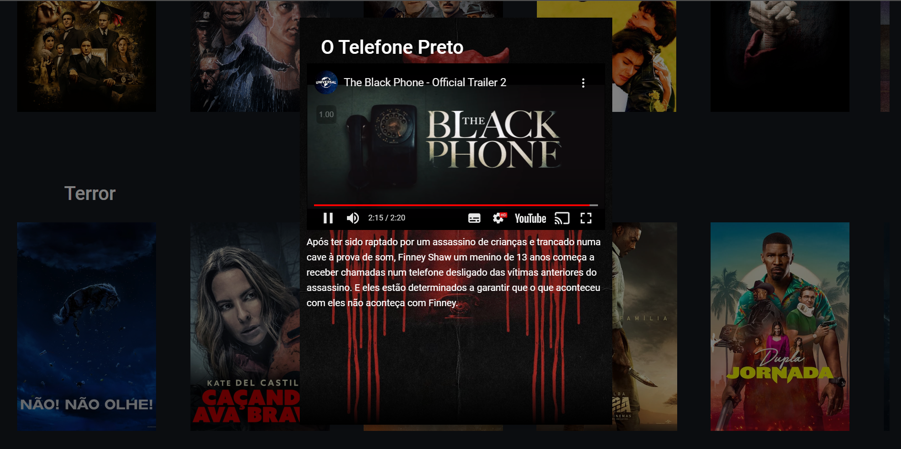

<h1 align="center">
  💻<br> 
  
  
</h1>

Um site de streaming, contendo vários filmes e séries. Site criado para portifólio, não tem uso externo e não está publicado em nenhum tipo de host.


<hr>
<br>

## 🎯 Status do projeto

🚧🏗️ Em Construção 🚧

<hr>
<br>

## 💼 Stack utilizada

Para o desenvolvimento deste site utilizei as seguintes tecnologias:

- Angular;
- Typescript;
- HTML;
- SCSS;

<hr>
<br>

## 💻 Rodando localmente

Clone o projeto

```bash
  git clone https://github.com/LuisSouza03/Horizon_Flix.git
```

Entre no diretório do projeto

```bash
  cd horizon_flix
```

Instale as dependências

```bash
  npm install
```

Inicie a aplicação

```bash
  ng s --o
```

<hr>
<br>

## 🚀 Screenshots




<hr>
<br>

## ❗ Variáveis de Ambiente

Para rodar esse projeto, você vai precisar adicionar as seguintes variáveis de ambiente no environment.ts

`API_KEY`

Que pode ser gerada na API do [TMDB](https://developers.themoviedb.org/3/getting-started/introduction)

<hr>
<br>

## 🧑🏽‍💻 Autor

- [@LuisSouza03](https://www.github.com/LuisSouza03)

<hr>
<br>

## 📝 Licença

Esse projeto está sob licença MIT. Veja o arquivo [LICENÇA](LICENSE) para mais detalhes. [MIT](https://choosealicense.com/licenses/mit/)

<br>
<br>

Copyright © 2022 - LuisSouzaz03

A permissão é concedida, gratuitamente, a qualquer pessoa que obtenha uma cópia deste arquivo, com restrição de publicar como seu repositório. Porém, sem restrição nos direitos de usar, copiar, modificar e mesclar.
